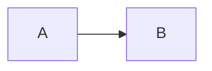

# Andy's Blog (andydai.dev)

Astro-based personal blog with i18n support (zh-tw + en).

## Commands

```bash
pnpm dev          # Start dev server (includes astro check)
pnpm build        # Build for production (includes LQIP generation)
pnpm new-post     # Create new post: pnpm new-post "Title" or pnpm new-post path/to/post.md
pnpm lint:fix     # Fix linting issues
```

## Project Structure

```
src/
├── content/posts/     # Blog posts (*.md)
├── content/about/     # About pages
├── pages/[...lang]/   # File-based routing with i18n
├── components/        # UI components
├── layouts/           # Layout components (Head.astro, Layout.astro)
├── plugins/           # Custom remark/rehype plugins
├── i18n/              # i18n config and utilities
├── utils/             # Helper functions
├── config.ts          # Centralized theme configuration
└── content.config.ts  # Content collection schemas
```

## Multi-language Content

### Adding a New Post

1. Create Chinese version in `src/content/posts/[slug].md`:
   ```yaml
   ---
   title: 文章標題
   published: 2026-02-01
   description: 文章描述
   tags: [tag1, tag2]
   lang: zh-tw
   abbrlink: my-post-slug  # Required for linking to English version
   toc: true
   ---
   ```

2. Create English version in `src/content/posts/[slug]-en.md`:
   ```yaml
   ---
   title: Post Title
   published: 2026-02-01
   description: Post description
   tags: [tag1, tag2]
   lang: en
   abbrlink: my-post-slug  # Must match Chinese version
   toc: true
   ---
   ```

### URL Structure

- Chinese (default): `/posts/[slug]/`
- English: `/en/posts/[slug]/`

### SEO/AEO Setup

Both versions automatically get:
- Self-canonical URLs
- Mutual hreflang references (when both exist)
- Correct `<html lang>` attribute

For English versions:
- Title should be natural English, not direct translation
- Rewrite Taiwan-specific examples for international context
- Meta description in English
- Maintain the author's voice and directness
- **Internal links must use `/en/posts/...`** (not `/posts/...`)

## Frontmatter Reference

| Field | Type | Description |
|-------|------|-------------|
| `title` | string | Post title |
| `published` | date | Publication date (YYYY-MM-DD) |
| `description` | string | Meta description |
| `updated` | date | Last update date |
| `tags` | string[] | Post tags |
| `lang` | `zh-tw` \| `en` \| `''` | Language (empty = universal) |
| `abbrlink` | string | URL slug (required for i18n linking) |
| `toc` | boolean | Show table of contents |
| `draft` | boolean | Hide from production |
| `pin` | number | Pin priority (1-99, higher = first) |
| `faqs` | array | FAQ items for AEO structured data |

### FAQ Schema (for AEO)

```yaml
faqs:
  - question: Question text?
    answer: Answer text.
```

## Markdown Features

### Admonitions

Both syntaxes work:

```markdown
:::note
Note content
:::

> [!TIP]
> Tip content
```

Types: `note`, `tip`, `important`, `warning`, `caution`

### Collapsible Sections

```markdown
:::fold[Click to expand]
Hidden content
:::
```

### Math (KaTeX)

```markdown
Inline: $E = mc^2$

Block:
$$
\int_0^\infty e^{-x^2} dx = \frac{\sqrt{\pi}}{2}
$$
```

### Mermaid Diagrams

````markdown

````

## Configuration

Main config in `src/config.ts`:
- Site info (title, description, URL)
- Colors (OKLCH format for light/dark modes)
- Global settings (locale, font style, date format)
- Comment system (Giscus/Twikoo/Waline)
- SEO (verification codes, analytics IDs)

## Technical Notes

- **Path alias**: `@/*` maps to `src/*`
- **Styling**: UnoCSS with Tailwind compatibility
- **Images**: Place in `src/content/posts/_images/`, LQIP auto-generated on build
- **Pre-commit**: ESLint auto-fix runs on staged files
- **Content utilities**: Functions in `src/utils/content.ts` are memoized
