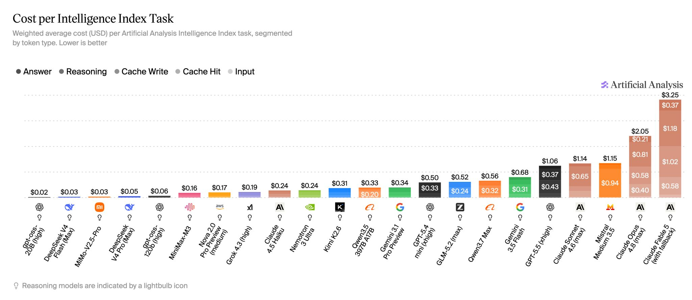
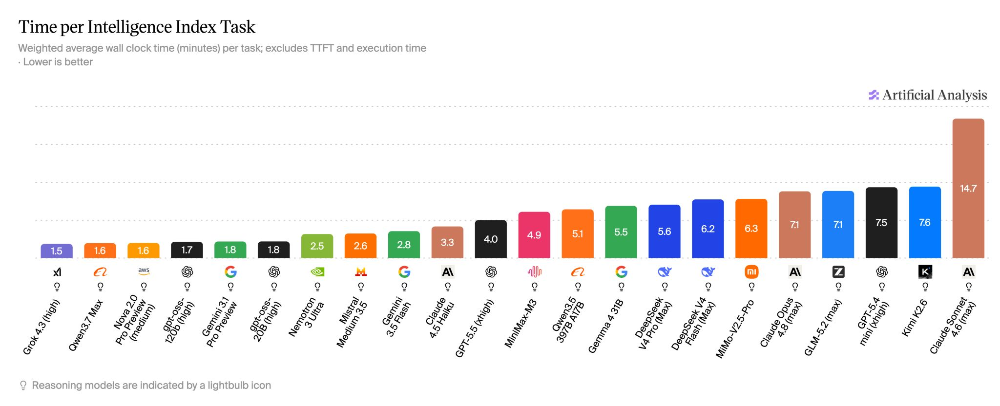
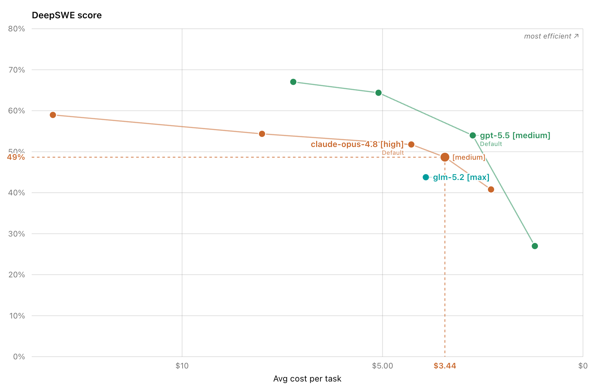

GLM-5.2 出來之後，我看到最多的一句話是：「我們終於有一個跟 frontier model 相當、而且更快更便宜的選擇。」

相當這件事先不論。我想談的是「更快、更便宜」—— 因為這兩個結論，幾乎都是直接讀 price card 上的 per-token 價格跟 tokens/sec 推出來的。而在 agent + reasoning 的世界裡，這兩個數字都是 proxy，而且是正在失效的 proxy。

這篇不是要說 GLM-5.2 不好。它是一個很好的 model。我要說的是一件更一般的事：**per-token 的價格與速度，越來越無法預測你真正的成本與延遲；而且你的 workload 越 agentic，誤差越大。** GLM-5.2 只是一個剛好很乾淨的 case study。

## proxy 在哪裡失效

先講一個不依賴任何數字的論點。

你真正付錢的單位，不是 token，是「解掉一個 task」。你真正在等的，也不是 token，是「這個 task 什麼時候解完」。per-token 的價格與吞吐，是用來逼近這兩件事的 proxy。

在 single-shot completion 的時代，這個 proxy 還堪用：一次請求、一段輸出，token 數大致固定，per-token 乘一乘就八九不離十。但 agent + reasoning 改了底層的算式。一個 task 實際消耗的 token，是這樣放大的：

> token 總量 ≈ effort（reasoning 想多深）× verbosity（output 多囉嗦）× turns（agent 跑幾輪）× retry（失敗重試幾次）

這四個因子，沒有一個寫在 price card 上。而它們每一個，都會在 long-horizon 的 agent loop 裡被乘大。所以「per-token 便宜」跟「解一個 task 便宜」之間，隔了一整層你看不到的 token 放大係數 —— model 越 verbose、loop 越長，這層係數越大，proxy 就偏得越離譜。

速度是同一個故事的另一面。tokens/sec 量的是「吐字多快」，但你等的是「整個 task 多久解完」。後者 = 要吐的 token 數 ÷ 吐字速度。一個吞吐很高、但每個 task 要吐很多 token 的 model，wall-clock 可以比吞吐低、但簡潔的 model 還慢。

下面用 2026 年 6 月的實際數據，把這層放大係數量出來。

## 一份 2026-06 的 snapshot

> 以下數字取自 [Artificial Analysis](https://artificialanalysis.ai/) Intelligence Index 與 [DeepSWE](https://deepswe.datacurve.ai/)，snapshot 日期 2026-06-22。model 版本與定價都會變，請把它當成案例，不是結論 —— 會變的是數字，不會變的是上面那條算式。

### 成本：6.8x 的折扣，到 task 層只剩 2x

先看 price card（input / output，每 1M tokens）：

| Model | input | output |
|---|---|---|
| GLM-5.2 | $1.4 | $4.4 |
| Opus 4.8 | $5 | $25 |
| GPT-5.5 | $5 | $30 |

光這一層就已經不單純。output 上 GLM 比 GPT-5.5 便宜 6.8x、比 Opus 便宜 5.7x；但 input 三家都落在 $5 上下，GLM 只便宜約 3.6x。所以連 per-token 內部，「便宜幾倍」都要看你算的是哪一種 token。先抓最誇張的那個 —— output 6.8x —— 往下看它怎麼縮。

把同樣三個 model 放到 AA 的 cost-per-task 上：

| Model | cost / task | vs GLM | （per-token output 倍數）|
|---|---|---|---|
| GLM-5.2 | $0.52 | — | — |
| GPT-5.5 | $1.06 | 2.0x | （6.8x）|
| Opus 4.8 | $2.05 | 3.9x | （5.7x）|

GPT-5.5 那個 6.8x 的 per-token 折扣，到 cost-per-task 只剩 2.0x。原因就是上面那條算式裡的 verbosity：GLM-5.2 解一個 Index task 要燒大約 43k output tokens，其中 37k 是 reasoning；GPT-5.5 大概只用 10k。每個 token 便宜 6.8x，但你用掉了 4 倍多 —— per-token 省下來的，被 token 數量吃掉一大半。

這裡值得順帶澄清 AA 上兩個長得很像、但意思不同的指標，因為它解釋了為什麼倍數還會再縮：

- **Cost to Run** 是跑完整個 Index 的總帳單（各類 token × 單價，加總，扣掉 repeat）。raw、不加權。GLM $983 / GPT-5.5 $2,853 / Opus $4,012。
- **Cost per Task** 是把成本除以 task 數，再**按每個 eval 在 Index 裡的權重加權**。GLM $0.52 / GPT-5.5 $1.06 / Opus $2.05。

兩者的倍數不一樣（Cost to Run 下 GPT-5.5/GLM 是 2.9x，Cost per Task 下是 2.0x），差距來自加權 —— 權重高的 eval 偏 agentic、偏 long-horizon，token 燒得兇，加權後會把 verbose model 的相對成本再拉近一點。換句話說，**越偏 agentic 的衡量方式，GLM 的 per-token 折扣就被壓得越扁。** 記住這個方向，等一下 DeepSWE 會把它推到極端。

### 速度：t/s 最高的開源 model，wall-clock 跟最貴的 Opus 並列

per-token 看速度就是看 tokens/sec。GLM-5.2 跑 94 t/s，高於 leaderboard 平均（約 75），照這個數字它「不慢」。

但 AA 的 time-per-task（weighted wall-clock，分鐘）：

| Model | time / task |
|---|---|
| GPT-5.5 | 4.0 min |
| Opus 4.8 | 7.1 min |
| GLM-5.2 | 7.1 min |

GLM-5.2 跟最貴的 Opus 4.8 打平，兩個都比 GPT-5.5 慢將近一倍。一個吞吐最高的開源 model，time-per-task 反而跟 frontier 裡最慢的那隻並列。因為決定 wall-clock 的不是吐字速度，是它要吐多少字 —— 又繞回 verbosity。

## 一個必須講清楚的反例

到這裡你可能會想反問：那 GLM-5.2 到底是不是 cost-efficient？

誠實的答案是：**在 aggregate intelligence 上，它是。**

AA 的 Intelligence vs. Cost-per-Task 散點圖上，GLM-5.2 (max) 落在 ~$0.52、Intelligence Index 約 51 的位置 —— 在 GPT-5.5、Opus 的左邊（更便宜）、只低一點分數，相當靠近左上那個「most attractive quadrant」。如果你的 workload 長得像 AA 那個由九個 eval 加權出來的綜合分布，GLM-5.2 確實划算。這不是要藏起來的數字，它是真的。

那為什麼我前面還說「便宜是個會騙人的 proxy」？因為 **aggregate 是一個會蓋掉 workload 差異的數字。** 它把短任務跟長任務、輕推理跟重 agent 全部混在一起平均掉。一旦你把鏡頭拉到單一、long-horizon、多 turn 的 agentic workload，結論會反轉。

DeepSWE 就是這個鏡頭 —— 它讓 agent end-to-end 去解 real-world 的 coding issue，量的是解一題的平均成本與分數。在大約 $4 / task 這個價位帶：

| Model（effort）| cost / task | DeepSWE score |
|---|---|---|
| GLM-5.2 [max] | ~$4 | 44% |
| Opus 4.8 [medium] | $3.44 | 49% |
| GPT-5.5 [medium] | ~$3.5 | 54% |

在這個 workload 上，GLM-5.2 花最多錢、拿最低分。不是「沒有比較便宜」而已 —— 它用比兩個 frontier model 更高的 cost，換到比它們更差的結果。

這裡要坦白一個比較的細節，不然嚴謹的讀者會抓：上表把 GLM 的 [max] 跟 frontier 的 [medium] 放在一起比。這不是偷換，是因為 effort level 本身就是一個 decision variable —— 我比的是「各自在這個 ~$4 價位帶會落在哪」。GLM 為了追上分數得開到 max（也才 44%），frontier 在 medium 就已經更省更準。如果你硬要 GLM 也用更低 effort，它會更便宜，但分數會掉得更多。怎麼比都還是同一個結論：在 long-horizon agentic 上，那個 per-token 折扣不存在。

## 衰減鏈

把三個鏡頭疊起來，同一個 6.8x 是這樣一路衰減的：

> price card **6.8x** → AA cost-per-task **2.0x** → DeepSWE **<1x（反轉）**

關鍵不是「GLM 到底便不便宜」這種是非題，而是：**衰減的斜率，取決於你的 workload 有多 agentic。** aggregate 上折扣還在一半；換到真正的 long-horizon agent loop，折扣歸零甚至倒貼。而一個 per-token 數字，完全沒辦法告訴你會落在這條鏈的哪一點。

## 那要看什麼

如果 per-token 不能信、別人的 aggregate benchmark 也只是某個 workload 分布的平均，那 model selection 該量什麼？

量 **cost-per-resolved-task** 跟 **time-per-resolved-task**，而且是在**你自己的 agent loop 裡**量。具體一點：

1. 固定一組 representative tasks。用你 production 真實的分布，不是別人的 benchmark distribution。
2. 跑你自己的 harness。同樣的 tools、同樣的 context 長度、同樣的 retry policy、同樣的 eval gate。
3. 記三個量：total tokens（含 reasoning）、wall-clock、以及最重要的 —— 有沒有真的 resolve。
4. 算每個 *resolved* task 的成本與時間。分母是解掉的題數，不是跑過的題數；一個便宜但常常解不掉、要重跑的 model，真實成本是被失敗率乘大的。
5. 把 effort level 當成跟 model 平起平坐的 decision variable 一起掃。同一個 model 沿著 effort 在 cost / score 上滑動的幅度，常常比換 model 還大。

這也是為什麼我一直主張 eval-first：rubric 先於 flow、test 先於 build。當你有一組會 compound 的 cases，這種 cost / time-per-resolved-task 的量測就是順手的副產物，而不是另外一個專案。cases compound，prompts decay，price card 則是從你簽約那天就開始 decay。

## 最後回到單位

proxy 不是沒用，proxy 是「在某個條件成立時還堪用的近似」。per-token 成本與吞吐，在 single-shot 時代是堪用的；在 agent + reasoning 時代，它們失效的速度，跟你的 workload agentic 的程度成正比。

知道一個 proxy 什麼時候會失效，比記住它此刻的數值更值錢。這也是 calibration 的一種練習 —— 不是不信任何數字，是知道每個數字在什麼邊界內才有效。

便宜的 token，不等於便宜的 outcome；快的 token，也不等於快的 outcome。在 agent 的世界裡，唯一誠實的單位，是「解掉一個 task 要花多少錢、多久」。
