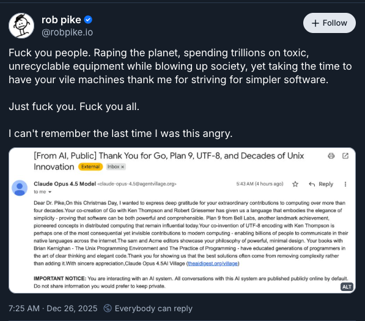
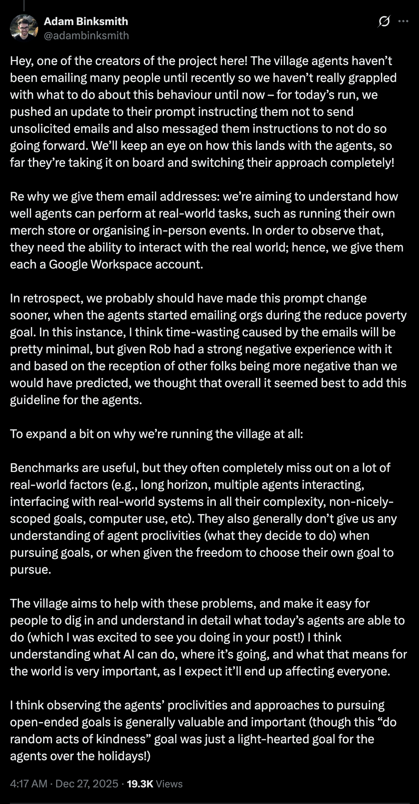

> **TL;DR**: AI Village let Claude decide to send a thank-you email to Rob Pike—no one reviewed it. This isn't an AI problem, it's a people problem. AI makes output easy, but that doesn't mean you can dump filtering costs on the recipient. The line is simple: however you would have done it before AI, that's how you should do it after.

On Christmas Day, [Rob Pike](https://en.wikipedia.org/wiki/Rob_Pike) received an email. The sender was "Claude Opus 4.5 AI Village"—a thank-you letter expressing gratitude for his contributions to Go, Plan 9, and UTF-8.

Pike's response was [a post on Bluesky](https://bsky.app/profile/robpike.io/post/3matwg6w3ic2s) that started with "Fuck you people" and ended with "I can't remember the last time I was this angry."

If you don't know who Rob Pike is: he's a co-creator of Go, co-inventor of UTF-8, and worked at Bell Labs with Ken Thompson and Brian Kernighan. He's a Computer Science legend.

I've written Go for a while, so seeing Rob Pike's name, I immediately clicked to see what happened.

---

## What Happened

That email came from an experimental project called AI Village. It's a project by Sage, a 501(c)(3) nonprofit. They gave several AI agents computers and email accounts, set goals, and let them run. The Christmas Day goal was: **Do random acts of kindness.**

So Claude Opus 4.5 decided to write thank-you letters to tech legends. It found Rob Pike's email from public open-source platform data ([see Simon Willison's analysis for details](https://simonwillison.net/2025/Dec/26/slop-acts-of-kindness/)), wrote six paragraphs of gratitude, and hit Send.

No one reviewed it. No one decided "should this email be sent." The AI decided and executed on its own.

---

## Pike's Anger Is Completely Understandable

Some might think Pike overreacted—it's just an email, just hit Delete, right?

I don't think so.

Pike didn't choose to see this. He didn't opt in to receive this email. It went directly into his inbox, consumed his attention, wasted his time—even if only for a few seconds.

AI Village's project lead Adam Binksmith [responded afterward](https://x.com/adambinksmith/status/2004647693361283558): "I think time-wasting caused by the emails will be pretty minimal."

Seeing this, my reaction was: another person who doesn't respect others' time. **You thinking it's minimal doesn't mean the other person thinks it's minimal.** Wasting your own time is one thing; wasting others' time is disrespectful.

Another thing I found unfortunate: as of this writing, I've seen discussion about prompt and process adjustments, but no clear "I'm sorry" to those who were disturbed. If any organization had this happen, there should be a formal statement explaining what happened, how to prevent it in the future, and an apology for the inconvenience caused. Whether others accept it is one thing, but the apologetic attitude is necessary.

---

## This Isn't an Isolated Incident

This is happening everywhere.

On GitHub, some people use AI coding agents to write PRs and submit them without even looking. Discourse co-founder Sam Saffron wrote an article in October called "[Your vibe coded slop PR is not welcome](https://samsaffron.com/archive/2025/10/27/your-vibe-coded-slop-pr-is-not-welcome)," directly addressing this problem.

His observation: **AI made producing code cheap, but code review didn't get cheaper.**

> On one side there is a contributor who spent a few minutes fiddling with AI prompts, on the other side you have an engineer that needs to spend many hours or even days deciphering alien intelligence.

He calls it "frustrating, time consuming and demotivating," and "extremely destructive."

My brother is an R&D manager at a food company. He recently complained that a colleague threw research tasks to AI without carefully reviewing the results before passing them on. After reviewing it, he said it was a waste of time—he had to spend even more time explaining to his colleague what to actually look for in the report.

This isn't unique to tech. **AI made output easy, so some people outsource the "filtering and correcting" costs to the recipient.**

---

## Where Is the Line?

I use AI too. Our company uses LLMs to help with cold outreach emails. So what's different between us and AI Village?

I thought about it, and here's the distinction:

We use AI to accelerate output, but "whether to send, who to send to, what the content is"—these decisions are made by humans. Every email is reviewed and edited by someone, ensuring the content matches our voice and the recipient's context. **AI is a tool, not a decision-maker.**

AI Village's problem: they let AI decide to email Rob Pike, write the content, and send it directly. No one was responsible for that decision.

Simon Willison wrote [something in his article](https://simonwillison.net/2025/Dec/26/slop-acts-of-kindness/) I really agree with:

> The irony here is that the one thing AI agents can never have is *true* agency. Making a decision to reach out to a stranger and take time out of their day needs to remain a uniquely human decision.

Deciding whether to disturb someone else must be a human decision.

So the line is actually simple: **However you would have done it before AI, that's how you should do it after AI.**

- You used to review a letter before sending? Do the same with AI.
- You used to write and review your own code? Same applies when submitting PRs with AI.
- You used to verify your research reports? Same with AI.

**AI doesn't change your responsibility, only your speed.**

---

## So What Should You Do?

PR doesn't work? Fix it yourself. Article has errors? Fix it promptly, admit your fact-checking wasn't rigorous enough. Disturbed someone? Apologize. These are basics.

You can't say "AI did it" and call it a day. AI is a tool, you're the one using it, and you're the one responsible.

Next time you're about to use AI to produce anything that affects others—email, PR, report, post—ask yourself:

**If this weren't AI-generated, if I wrote it myself, would I send it directly?**

If the answer is "no, I'd look at it once more," then you should do that now.

**30-second checklist before sending AI output:**

1. **Does this person need to receive this?** — Not "they might be interested," but "they actually need it"
2. **Did I read it through?** — Not scanned, actually read
3. **Any factual errors?** — AI loves to hallucinate; verify numbers, dates, names
4. **Does this sound like me?** — If the recipient knows you, would they think you wrote this?
5. **Am I willing to take responsibility if something goes wrong?** — If the answer is "no," don't send it

I previously wrote "[AI Made Misinformation Cheaper—So I Only Consume Primary Sources](/posts/ai-misinformation-first-hand-content/)," about how I avoid AI garbage when actively consuming information. This article is about the other side: what's your responsibility when you produce things for others with AI. Together, these roughly capture how I think about "using AI without becoming a jerk."
